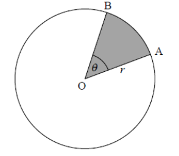

Q 1.
====

Soit la fonction :math:`f(x) = 6x^2-3x` representé ci-dessous.

La figure n'est pas à l'échelle.

   ..

A) Trouvez :math:`\int \! (6x^2-3x) \, \mathrm{d}x`.

B)

   Trouvez l’aire de la région délimitée par la représentation graphique de :math:`f(x)`,
   
   l’axe des abscisses et les droites :math:`x = 1` et :math:`x = 2`.
   
   C'est à dire :math:`\int_1^2 \! (6x^2-3x) \, \mathrm{d}x`.
