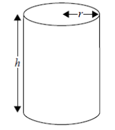

Q 2.
====

Une boîte en métal, cylindrique et fermée, de rayon égal à :math:`r` centimètres et de hauteur égale à :math:`h` centimètres possède un volume de :math:`20\pi\, cm^3`.

La figure nest pas à l'échelle.

   ..

A) Exprimez :math:`h` en fonction de :math:`r`.

Le métal pour la base et le couvercle de la boîte coûte 10 cents le :math:`cm^2` et le métal pour le côté incurvé coûte :math:`8` cents le :math:`cm^2`.

Le coût total du métal, en cents, est de :math:`C`.

B) Montrez que :math:`C\,=\,20\pi{}r^2 + \frac{320\pi}{r}`

C) Sachant qu’il existe une valeur minimale pour :math:`C`, trouvez cette valeur minimale en fonction de :math:`\pi`.
   
