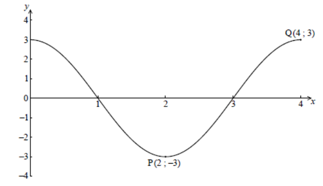

Q 4.
====

La figure suivante donne la représentation graphique de :math:`f(x) = a\,Cos\,bx`,
pour :math:`0 \le x \le 4`.

La figure nest pas à l'échelle.

   ..

Il y a un point minimum en :math:`P( 2, -3 )` et un point maximum en :math:`Q( 4, 3 )`.   

A)

   i)  Donnez la valeur de :math:`a`.

   ii) Trouvez la valeur de :math:`b`.

B)

   Donnez la pente de la courbe en :math:`P`.

C)   

   Donnez l’équation de la normale à la courbe en :math:`P`.
