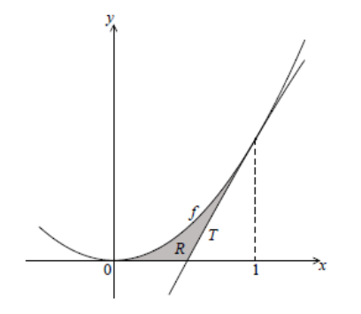

Q 7.
====

La figure suivante représente une partie de la représentation graphique de la fonction :math:`f(x) = 2x^2`.

La figure nest pas à l'échelle.

   ..

La droite :math:`T` est la tangente à la représentation graphique de :math:`f` en :math:`x = 1`.

A) Montrez que l’équation de :math:`T` est :math:`y = 4x - 2`.

B) Trouvez l’abscisse à l’origine de :math:`T`.

C) La région grisée :math:`R` est limitée par la représentation graphique de :math:`f`, la droite :math:`T` et l’axe des abscisses.

   i)  Donnez une expression de l’aire de :math:`R`.

   ii) Trouvez l’aire de :math:`R`.
