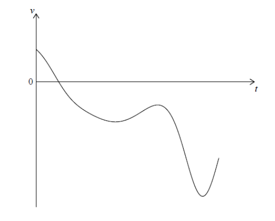

Q 16.
=====

Une particule :math:`P` se déplace le long d’une droite. Le vecteur vitesse :math:`v` :math:`ms^{-1}` de :math:`P` après :math:`t` secondes est donnée par :math:`v(t) = 7 cos t - 5t^{cos t}`, pour :math:`0 \le t \le 7`.

Le diagramme suivant montre la représentation graphique de :math:`v`.

La figure nest pas à l'échelle.

   ..

A)

   Trouvez le vecteur vitesse initiale de :math:`P`.

B)

   Trouvez la vitesse maximale de :math:`P`.

C)

   Écrivez le nombre de fois où l’accélération de :math:`P` est :math:`0` :math:`ms^{-2}`.

D)

   Trouvez l’accélération de :math:`P` lorsque la particule change de direction.

E)

   Trouvez la distance totale parcourue par :math:`P`.
   

