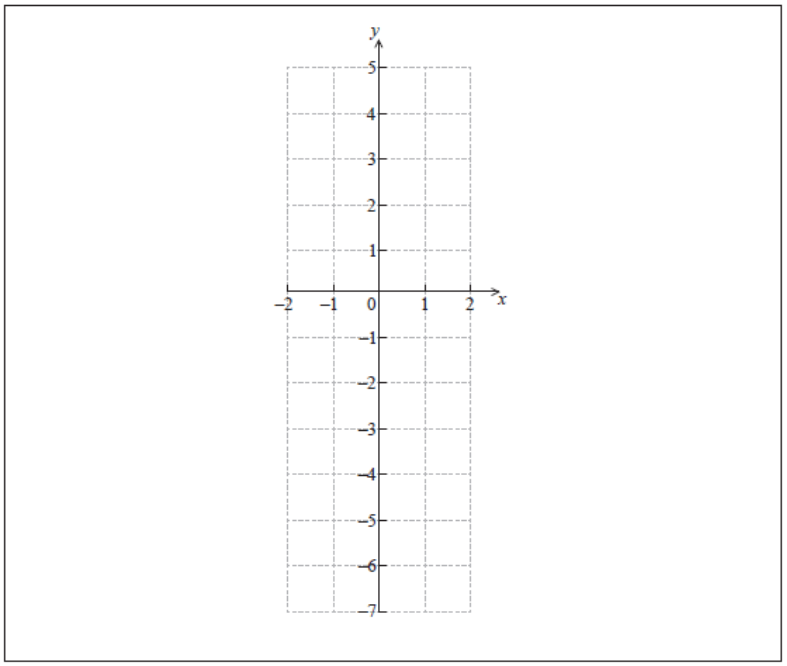

Q 17.
=====

Soit :math:`f(x) = Cos(e^x)`, pour :math:`-2 \le x \le 2`.

A)

   Trouvez :math:`f^\prime(x)`.

B)

   Sur le système d'axes ci-dessous, esquissez la représentation graphique de :math:`f^\prime(x)`.

   ..

