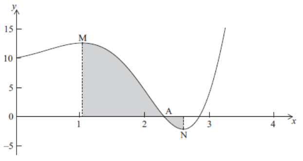

Q 21.
=====

Soit :math:`f(x) = e^x Sin 2x + 10`, avec :math:`0 \le x \le  4`.

Une partie de la représentation graphique de :math:`f` est donnée ci-dessous.

La figure nest pas à l'échelle.

   ..

Sont représentés une abscisse a l'origine au point :math:`A`, un maximum relatif au point :math:`M` avec :math:`x = p` et un minimum relatif au point :math:`N` avec :math:`x = q`.

A)

   Donnez l'abscisse de :math:`A`.

B)

   Trouvez la valeur de

   i)

      :math:`p`

   ii)

      :math:`q`

C)

   Trouvez :math:`\int_p^qf(x)dx`.

   Expliquez pourquoi ceci n'est pas l'aire de la région grisée.

   

