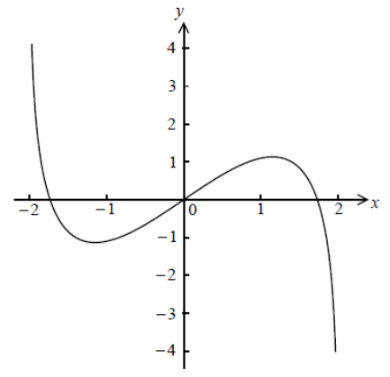

Q 22.
=====

On considère :math:`f(x) = x\ln(4 - x^2)`, avec :math:`-2 < x < 2`.

Une partie de la représentation graphique de :math:`f` est donnée ci-dessous.

   ..

Soient :math:`P` et :math:`Q` les points de la courbe représentant :math:`f`
où la tangente à la représentante graphique de :math:`f` est
parallèle à l'axe des abscisses.
   
A)

   i)

      Trouvez l'abscisse de :math:`p` et :math:`q`.

   ii)

      On considère :math:`f(x) = k`.
      
      Donnez toutes les valeurs de :math:`k` pour les-quelles il y a exactement deux solutions.

      

Soit :math:`g(x) = x^3\ln(4 - x^2)`, avec :math:`-2 < x < 2`.

B)

   Montrez que :math:`g^\prime(x)=\frac{-2x^4}{4 - x^2} + 3x^2\ln(4 - x^2)`.

C)

   Esquissez la représentation graphique de :math:`g^\prime`.

D)

   On considére :math:`g^\prime(x) = w`.

   Donnez toutes les valeurs de :math:`w` pour les-quelles il y a exactement deux solutions.

