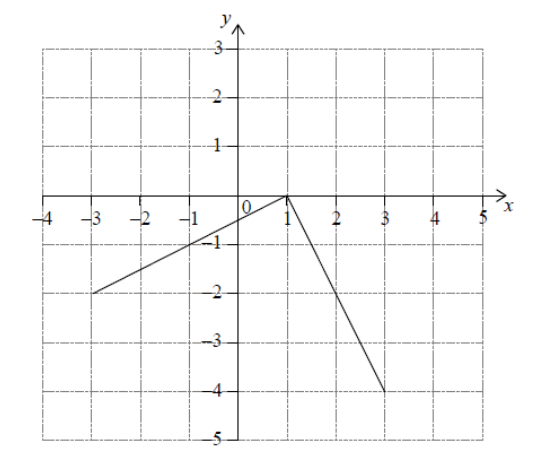

Q 1.
====
 
Le diagramme suivant est la représentation graphique de la fonction :math:`f(x)` pour :math:`-4 \le x \le 2`.

Diagramme :math:`A`

.. figure:: images/diagramme_x1a.png
   :scale: 40 %

   ..

   
Sur le système d'axes du diagramme :math:`A` esquissez la représentation graphique de :math:`f(-x)`
   
Une autre fonction, :math:`g`, peut s’écrire sous la forme :math:`g(x) = a \times f(x + b)`.

Le diagramme suivant montre la représentation graphique de :math:`g`.

Diagramme :math:`B`

   ..
   

Selon le diagramme :math:`B`, écrivez la valeur de :math:`a` et de :math:`b` de la fonction :math:`g`
   

