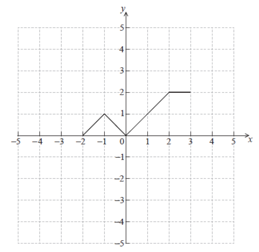
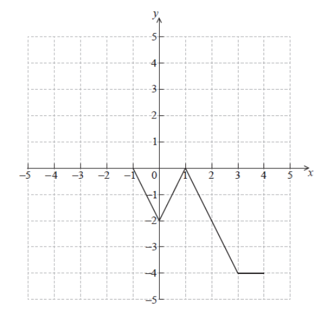
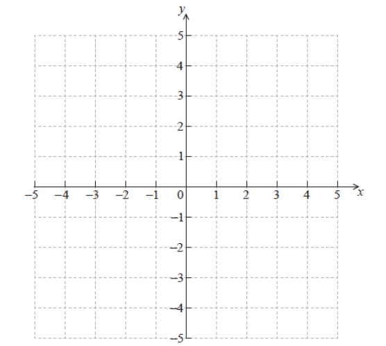

Q 4.
====

La fonction :math:`f(x)` pour :math:`-2 \le x \le 3` est representé ci-dessous.

   ..
   
La représentation graphique de :math:`f` est transformée pour obtenir celle de :math:`g` représentée ci-dessous.

   ..

   
A)

   Esquissez la representation graphique :math:`f(-x)` sur le système d'axe ci-dessous.

   ..

B)

   La fonction :math:`g`  peut s'écrire sous la forme :math:`g(x) = a\,f(x + b)`.
   
   Donnez la valeur de :math:`a` et celle de :math:`b`.
   
