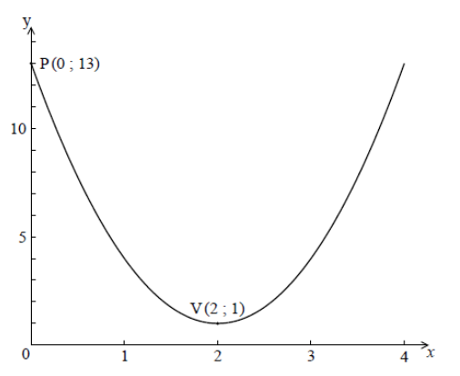

Q 6.
====

La fonction quadratique :math:`f(x)`, pour :math:`0 \le x \le 4` est représentée ci-dessous.

   ..

La courbe passe par le point :math:`P(0; 13)`, et son sommet est le point :math:`V(2; 1)`.   

A)

   La fonction peut s'écrire sous la forme :math:`f(x) = a(x-h)^2 + k`.

   i)

      Donnez la valeur de :math:`h` et celle de :math:`k`.

   ii)

      Montrez que :math:`a=3`.
      
B)

   Calculez l'aire délimitée par la courbe de :math:`f`, l’axe des abscisses :math:`x`, et les droites :math:`x=2` et :math:`x=4`.

   
   
