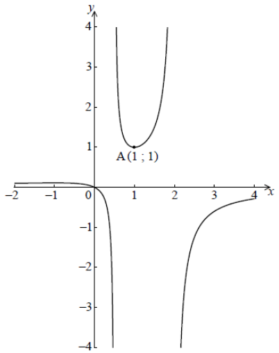

Q 7.
====

Soit la fonction :math:`f(x) =\frac{x}{-2x^2 + 5x - 2}`, pour :math:`-2 \le x \le 4`, :math:`x \ne \frac{1}{2}`, :math:`x\ne2` représentée ci-dessous.

   ..

La courbe a un minimum local en :math:`A(1;1)` et un maximum local en :math:`B`.

A)

   Utilisez la règle de dérivation du quotient pour montrer que :math:`f^\prime(x)=\frac{2x^2 - 2}{(-2x^2+5x-2)^2}`

B)

   À partir de là, trouvez les coordonnées de :math:`B`.

C)

   Étant donné que la droite :math:`y=k` ne rencontre pas la courbe de :math:`f`,
   trouvez les valeurs possibles de :math:`k`.
