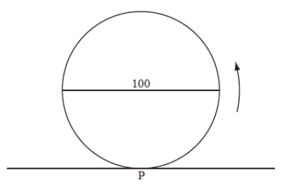
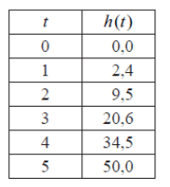

Q 9.
====

La grande roue d'un parc de loisir: son diamètre est do 100 mètres.
Figure A.

   ..

Tableau de hauteurs de :math:`P` en mètres par rapport au sol après :math:`t` minutes.
Tableau B.
   

   ..

Soit :math:`P` un point de la roue. La roue démarre avec :math:`P` à son point le plus bas, au niveau du sol.

La roue tourne avec une vitesse constante, dans le sens contraire des aiguilles
d’une montre. Un tour complet prend :math:`20` minutes.
   

A)

   Donnez la hauteur de :math:`P` par rapport au sol après..

   i)
   
      :math:`10` minutes

   ii)

      :math:`15` minutes   

B)

   Soit :math:`h(t)` la hauteur de :math:`P` par rapport au sol en mètres après :math:`t` minutes.

   i)

      Montrez que :math:`h(8)=90,5`.

   ii)

      Trouvez :math:`h(21)`.

C)

   Esquissez la représentation graphique de :math:`h`, avec :math:`0 \le t \le 40`.

D)

   Étant donné que :math:`h` peut s’exprimer sous la forme :math:`h(t) = a\,Cos\,bt + c`,
   trouvez :math:`a` , :math:`b` et :math:`c`.

   
   
