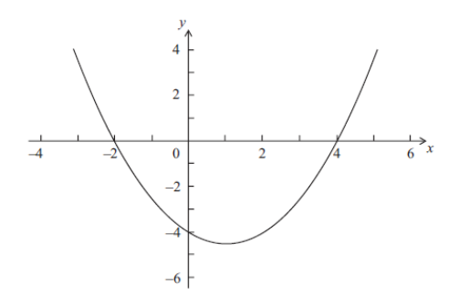

Q 10.
=====

Soit :math:`f(x)=p(x-q)(x-r)`.

Une partie de la représentation graphique de :math:`f` est illustrée ci-dessous.

   ..

Elle passe par les points :math:`(-2; 0)`, :math:`(0; -4)` et :math:`(4 ; 0)`.
   

A)

   Donnez la valeur de :math:`q` et de :math:`r`.   

B)

   Donnez l'équation de l'axe de symétrie.
   
C)

   Trouvez la valeur de :math:`p`.

   
