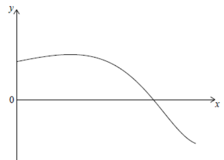

Q 19.
=====

Soit :math:`f(x) = sin(e^x)` pour :math:`0 \le x \le 1,5`.

Le diagramme suivant montre la représentation graphique de :math:`f`.
 

   ..

Trouvez l'abscisse à l'origine de la représentation graphique de :math:`f`.

