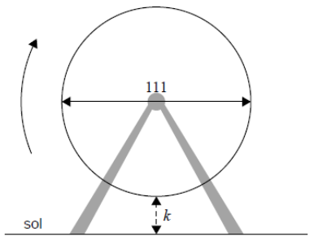

Q 20.
=====

Dans un parc d'attractions, une grande roue dont le diamètre est de :math:`111` mètres tourne à une vitesse constante.

Le bas de la roue est :math:`k` mètres au-dessus du sol.

Un siège part du bas de la roue.

La figure n'est pas à l'échelle.

   ..

La roue complète un tour en 16 minutes.

Après :math:`t` minutes, la hauteur du siège au-dessus du sol est donnée par
:math:`h(t) = 61,5 + a\,cos\left(\frac{\pi}{2}t\right)`, pour :math:`0 \le t \le 32`.

A)

   Après :math:`8` minutes, le siège est :math:`117` m au-dessus du sol.
   Trouvez :math:`k`.

B)

   Trouvez la valeur de :math:`a`.

C)

   Trouvez quand le siège est :math:`30` m au-dessus du sol pour la troisième fois.

   
