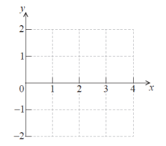

Q 23.
=====

Soit :math:`g(x) = \frac{1}{2}x\,sin\,x`, avec :math:`0 \le x \le 4`.

A)

   Esquissez la représentation graphique de :math:`g` sur le repère ci-dessous.

   ..
   

B)

   À partir de là, trouvez la valeur de :math:`x` pour laquelle :math:`g(x) = -1`.
   
