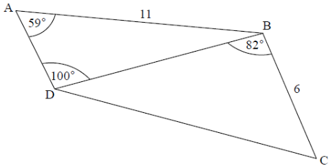

Q 2.
====

La figure nest pas à l'échelle.

	   
   Le diagramme montre le quadrilatère :math:`ABCD`.

:math:`AB = 11cm`, :math:`BC = 6cm`, :math:`\angle\,BAD = 59^\circ`, :math:`\angle\,ADB = 100^\circ` et :math:`\angle\,CBD = 82^\circ`

      
Trouvez DB.

Trouvez DC.

	   

