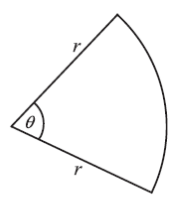

Q 3.
====

La figure nest pas à l'échelle.

   La figure représente un secteur d'un cercle de rayon :math:`r\,cm` et d'angle au centre :math:`\theta`. Le périmetre du secteur est de :math:`20\,cm`.
	   
      
A) Montrez que :math:`\theta = \frac{20 - 2r}{r}`.

B) L'aire de ce secteur est de :math:`25\,cm^2`. Trouvez la valeur de :math:`r`.

	   

