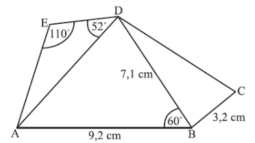

Q 4.
====

La figure nest pas à l'échelle.

   ..
   
La figure représente un pentagone :math:`ABCDE`.

Tel que: :math:`AB = 9,2\,cm,  BC = 3,2\,cm, BD = 7,1\,cm, \angle\,AED = 110^\circ, \angle\,ADE = 52^\circ,` et :math:`\angle\,ABD = 60^\circ`
	   

A) Trouvez :math:`AD`.

B) Trouvez :math:`DE`.

C) L'aire du triangle :math:`BCD` est :math:`5,68\,cm^2`. Trouvez :math:`\angle\,DBC`.

D) Trouvez :math:`AC`.
   

   

	   

