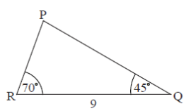

Q 5.
====

La figure nest pas à l'échelle.

   ..

La figure montre :math:`\bigtriangleup\,PQR`, tel que :math:`RQ = 9\,cm`, :math:`\angle\,PRQ = 70^\circ`. :math:`\angle\,PQR = 45^\circ`.

A) Trouvez :math:`\angle\,RPQ`.

B) Trouvez :math:`PR`.
      
C) Trouvez l'aire de :math:`\bigtriangleup\,PQR`.

   

	   

