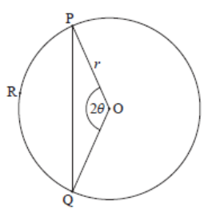

Q 6.
====

La figure nest pas à l'échelle.

   ..

La figure montre le cercle de centre :math:`O` et de rayon :math:`r`.

Les points :math:`P`, :math:`R` et :math:`Q` sont sur la circonférence, :math:`\angle\,POQ = 2\theta`, pour :math:`0 < \theta < \frac{\pi}{2}`.

A) Utilisez la loi des cosinus pour montrer que :math:`PQ = 2r\,sin\,\theta`.

B) Soit :math:`l` la longueur de l'arc :math:`PRQ`.  Étant donnez que :math:`1,3PQ - l = 0`, trouvez la valeur de :math:`\theta`.

C) Considérez la fonction :math:`f(\theta) = 2,6\,sin\,\theta - 2\theta`, pour :math:`0 < \theta < \frac{\pi}{2}`.
   
   i)  Esquissez la représentation graphique de :math:`f`.

   ii) Donnez la racine de :math:`f(\theta) = 0`.

D) Utilisez la courbe :math:`f` pour trouver les valeurs de :math:`\theta` pour lesquelles :math:`l < 1,3\,PQ`.

   

   

	   

