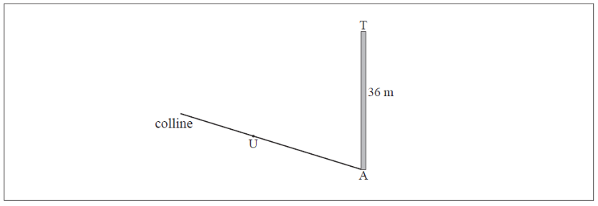

Q 7.
====

Il y a, au pied d'une colline une tour verticale :math:`TA` de :math:`36 \,m` de hauteur. Un chemin rectiligne monte la colline depuis :math:`A` vers un point :math:`U`. Ces informations sont représentées par la figure suivante.

La figure nest pas à l'échelle.

   ..

Le chemin fait un angle de :math:`4^\circ` avec l'horizontale.

Le point :math:`U` sur le chemin est à :math:`25\,m` de la base de la tour.

Le sommêt de la tour est relié à :math:`U` par un câble de longueur :math:`x` (en :math:`m`).

A) Complétez la figure en représentant clairement les informations ci-dessus.

B) Trouvez :math:`x`.

   

   

	   

