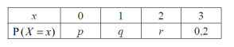

Q 4.
====
 
La variable aléatoire :math:`X` suit la distribution de probabilité suivante, avec :math:`P(X >1) = 0,5`.

   ..
   

A)

   Trouvez la valeur de :math:`r`.
   

B)

   Étant donné que :math:`E(X ) = 1,4`, trouvez la valeur de :math:`p` et celle de :math:`q`.

