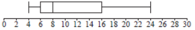
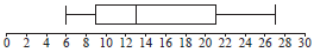
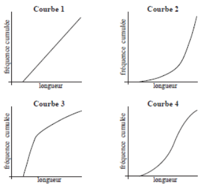

Q 6.
====

Une scientifique étudie :math:`100` poissons femelles et :math:`100` poissons mâles.
Elle mesure leur longueur (arrondie au centimètre le plus proche).
Les résultats sont donnés dans les diagrammes à boîtes et moustache suivants.

Poissons femelles

   ..

Poissons mâles

   ..

A)

   Trouvez l’étendue des longueurs de tous les :math:`200` poissons.

   
Quatre courbes de fréquence cumulée sont représentées ci-dessous.
   

   ..

B)

   Quelle courbe représente le mieux les longueurs des poissons femelles?
