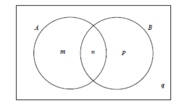

Q 7.
====

Le diagramme de Venn ci-dessous représente les événements :math:`A`  et :math:`B`
où :math:`P(A) = 0,3`, :math:`P(A \cup B) = 0,6` et :math:`P(A \cap B) = 0,1`.

Les valeurs :math:`m`, :math:`n`, :math:`p` et :math:`q` sont des probabilitées.

   ..

A)

   i)

      Donnez la valeur de :math:`n`.
   
   ii)

   Trouvez la valeur de :math:`m`, :math:`p` et de :math:`q`.

B)

   Trouvez :math:`P(B)`.
   

