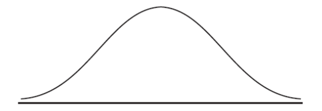

Q 10.
=====

Les poids des enfants d’un groupe sont normalement distribués avec une
moyenne de :math:`22,5 kg` et un écart-type de :math:`2,2 kg`.

A)

   Donnez la probabilité qu’un enfant choisi au hasard ait un poids supérieur à :math:`25,8 kg`.

B)

   :math:`95{\%}` des enfants de ce groupe pèsent moins de :math:`k` kilogrammes.
   Trouvez la valeur de :math:`k`.
   
C)
   
  La figure ci-dessous représente une courbe normale.
  
  Sur cette figure, hachurez la région qui représente l’information suivante :
  
  :math:`87{\%}` des enfants pèsent moins de :math:`25 kg`.

   ..

   

