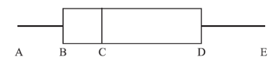

Q 11.
=====

Un ensemble de données est: :math:`\left[ 18, 18, 19, 19, 20, 22, 22, 23, 27, 28, 28, 31, 34, 34, 36 \right]`

Le diagramme à boîtes et moustache de ces données est représenté ci-dessous.
 

	   
   ..

A)

   Donnez les valeurs:

   :math:`A`
	 
   :math:`B`
	 
   :math:`C`
	 
   :math:`D`
	 
   :math:`E`
	 
B)

   Trouvez l’intervalle interquartile.

   

