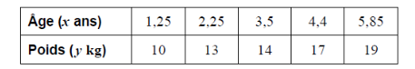

Q 12.
=====

Le tableau suivant montre le poids moyen, :math:`y\,kg` , d’enfants âgés de :math:`x\,ans`.

   ..

La relation entre les variables est modélisée par la droite de régression d’équation :math:`y = ax + b`.

A)

   i)

      Trouvez la valeur de :math:`a` et celle de :math:`b`.
   
   ii)
   
      Écrivez le coefficient de corrélation.

B)

   Utilisez votre équation pour estimer le poids moyen d’un enfant âgé de :math:`1,95 ans`.
   

