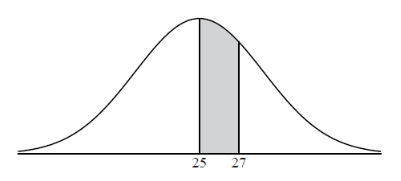

Q 16.
=====

Soit la variable aléatoire X normalement distribuée avec une moyenne de :math:`25`,
comme le montre la figure ci-dessous.

   ..

La région grisée entre :math:`25` et :math:`27` représente :math:`30{\%}` de la distribution.

A)

   Trouvez :math:`P(X > 27)`

B)

   Trouvez l’écart-type de :math:`X`.

