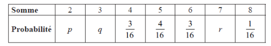

Q 17.
=====

Deux dés équilibrés à quatre faces, l’un rouge et l’autre vert, sont jetés.
Pour chaque dé, les faces sont marquées :math:`1, 2, 3, 4`.
Le score pour chaque dé est le nombre sur la face sur laquelle le dé tombe.

A)

   Listez les paires de scores qui donnent une somme de :math:`6`.

La distribution de probabilités pour la somme des scores des deux dés est donnée ci-dessous.

   ..

B)

   Trouvez la valeur de :math:`p`, de :math:`q` et de :math:`r`.

Fred joue à un jeu. Il lance quatre fois deux dés équilibrés à quatre faces.
Il gagne un prix si la somme est :math:`5` pour trois lancers ou plus.

C)

   Trouvez la probabilité que Fred gagne un prix.

   

