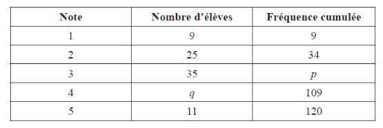

Q 18.
=====

Le tableau ci-dessous donne les notes d’examen de :math:`120` élèves.

   ..

A)

   Trouvez la valeur de

   i)

      :math:`p`.

      
   ii)

      :math:`q`.

B)

   Trouvez la note moyenne.

C)

   Donnez l'écart-type.

   

   

