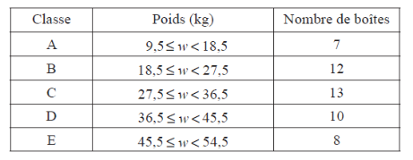

Q 20.
=====

Il y a :math:`50`  boîtes dans une usine.
Les poids, :math:`w` en :math:`kg`, sont divisés en :math:`5` classes,
comme le montre le tableau ci-dessous.
 

   ..

A)

   Montrez que le poids moyen estimé des boîtes est :math:`32\,kg`.

B)

   Dans l’usine, il y a :math:`x` boîtes marquées « Fragile ».
   Elles sont toutes dans la classe :math:`E`.
   Le poids moyen estimé de toutes les autres boîtes dans l’usine est :math:`30\,kg`.

   Calculez la valeur de :math:`x`.

C)

   Une livraison de :math:`y` boîtes supplémentaires,
   toutes ayant un poids dans la classe :math:`D`, est apportée à l’usine.

   Le poids moyen estimé total de toutes les boîtes dans l’usine est inférieur à :math:`33\,kg`.

   Trouvez la plus grande valeur possible de :math:`y`.
   

   

